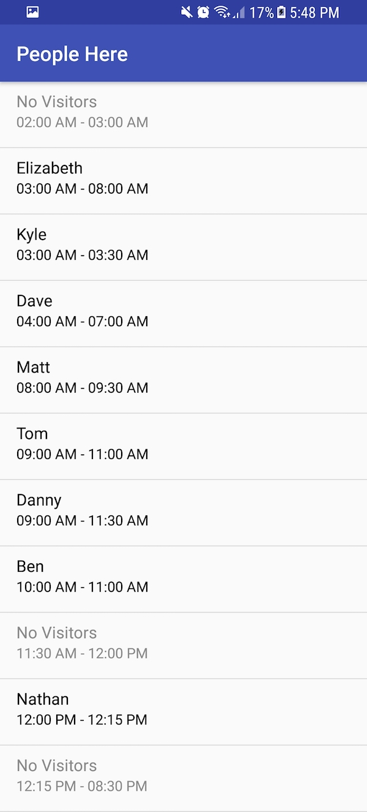

# Android Take Home Interview
Hello! For this portion of the interview, we’d like you to help us implement two bits of functionality.

We will review your code for correctness, but we will also consider its design, efficiency, and readability. You should test the code well enough that you think it's correct, but you don't need to include any tests in your submission. You may also assume that the input is well-formed (e.g. JSON is valid, all fields have the correct type, `arriveTime` is always before `leaveTime`).

## Background

Venue Visitors: Merchants may want to know some analytics about who is visiting their venue. We want to show the people who have visited, and the time that their venue is idle. We’d like to build something to show the people at a venue (*sorted by arrival time*) filling in the gaps for open to close.

## Getting Started

We have provided you with an input JSON file in the [main/assets](app/src/main/assets) directory. We will parse in the JSON file. You should use the data to populate the RecyclerView. Use the provided `VenueStore` class to retrieve the Venue data.

### This is how your output should look:

[screenshot/PeopleHere.jpg](screenshot/PeopleHere.jpg)

Note: The time label should be formatted exactly in this way: `01:30 PM - 02:30 PM`.
We have provided placeholder strings for `No Visitors` and the time label.

Familiarize yourself with people.json:
- Note that the visitors are not sorted in any way.
- Timestamps are in Unix time (milliseconds since January 1, 1970).

You will need to write a small algorithm to find idle intervals where no visitor is present at the venue.  *Your solution should include comments in your code that describes how your algorithm works, a discussion of any trade-offs or assumptions you made in your design, and an analysis of its running time* (hint: you can do better than O(n²), where n is the number of visitors).

## Tips & FAQs
- We aren't looking for gotchas or future proofing. Your solution should solve the problem but does not need to worry about features we haven't asked for (e.g. you don't need to persist any data to disk).
- You are welcome to use any third party libraries you feel comfortable with - please append any relevant information (name and/or URL) for the libraries used to this README. You should not need any extra libraries, but we won't penalize you for using one. _Make sure the solution code you send back to us compiles on the latest version of Android Studio without any additional steps._
- You are welcome to modify any of the classes we have given you, but you don't have to worry about improving the architecture or "fixing" anything in the boilerplate code we've provided.
- We are going to test your app against other data-sets than the one given. Please try to consider edge-cases when writing your algorithm and RecyclerView adapter logic.
